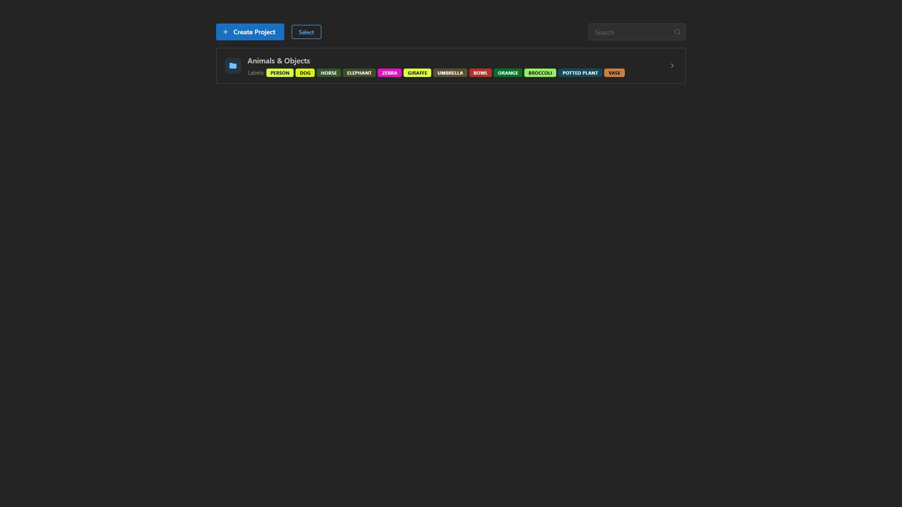
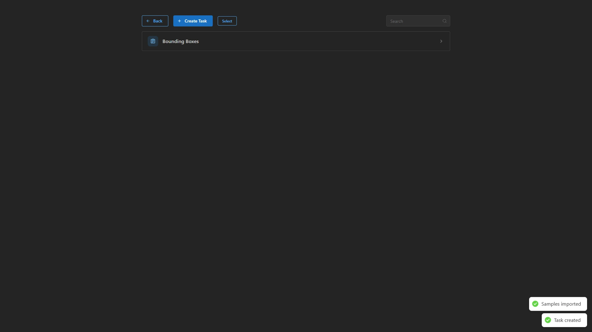
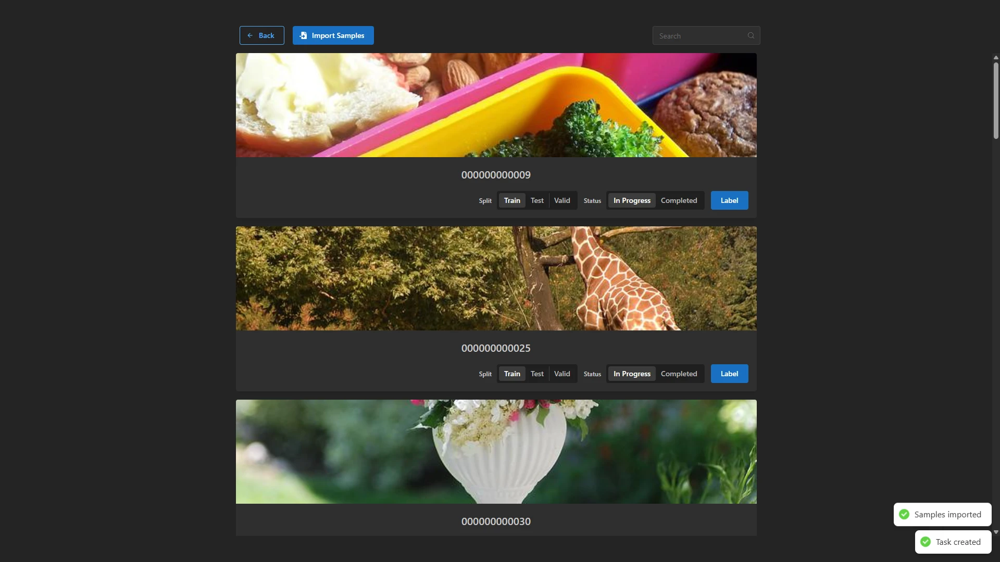
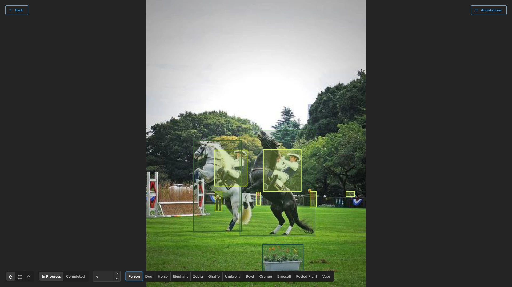
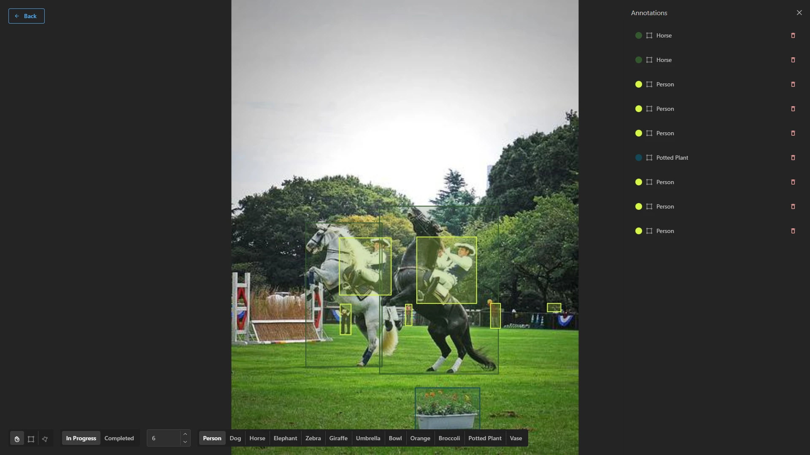

# cv-label

A desktop app for labeling image datasets for computer vision. Organize work into
Projects → Tasks → Samples, and annotate images with bounding boxes or polygons
in a canvas-based labeler with pan/zoom and per-label colors.

Built with Electron, React, and TypeScript. Data is stored locally in SQLite by
default, behind an `IDataStore` interface designed to be swapped for other backends
(e.g. an HTTP-based store) without touching any UI code.

## Screenshots

| Projects | Tasks | Samples |
| :---: | :---: | :---: |
|  |  |  |

| Bounding boxes | Segmentation | Annotations panel |
| :---: | :---: | :---: |
|  |  |  |

Sample images are from the [COCO dataset](https://cocodataset.org), used here for
demonstration only.

## Data formats

Import/export YOLO, COCO, and this app's own `.cvlabel` archive format — see
[`formats/`](./formats) for the `.cvlabel` spec.

## Recommended IDE Setup

- [VSCode](https://code.visualstudio.com/) + [ESLint](https://marketplace.visualstudio.com/items?itemName=dbaeumer.vscode-eslint) + [Prettier](https://marketplace.visualstudio.com/items?itemName=esbenp.prettier-vscode)

## Project Setup

### Install

```bash
$ pnpm install
```

### Development

```bash
$ pnpm run dev
```

### Build

```bash
# For windows
$ pnpm run build:win

# For macOS
$ pnpm run build:mac

# For Linux
$ pnpm run build:linux
```

## Testing

### Unit tests

Component and utility tests, run with [Vitest](https://vitest.dev/) + React Testing
Library:

```bash
$ pnpm run test
```

### End-to-end tests

Full app tests driven by [Playwright](https://playwright.dev/), launching the real
built Electron app (page objects live in `e2e/pages/`):

```bash
$ pnpm run test:e2e
```

Electron has no headless mode, so this opens real windows while it runs. On Linux CI
(see `.github/workflows/ci.yml`), that's handled by running under Xvfb rather than by
hiding the window, since Electron/Chromium throttle rendering for hidden windows, which
makes tests slower and flakier, not faster.

## CI

Pull requests and pushes to `master` run both test suites via GitHub Actions
(`.github/workflows/ci.yml`). `master` is protected, so changes go through a PR and are
squash-merged.
